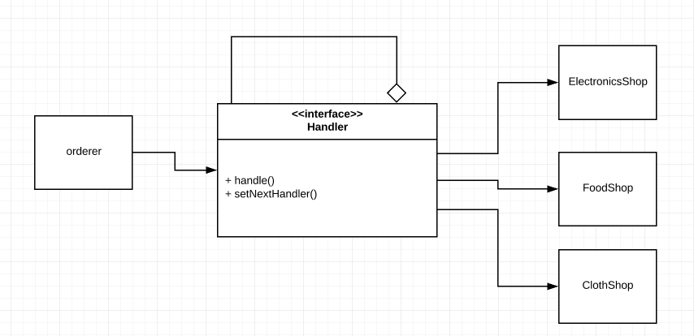

# Ordering App

## How this implementation achieves the Chain of Responsibily Pattern
- request to objects are chained

## Participants and their Roles
### Participants
- Handler: Handler in [handler.js](./handler.js)
- ConcreteHandler: ElectronicShop, Foodshop and ClothingShop in [handler.js](./handler.js)
- Client: OrderingApp in [App.js](./App.js)

### Roles
Handler
- This defines the interface for other handlers.
- Most of the logic is done here since the concreteHandlers share similar state.

## UML Class and Sequence Diagrams

