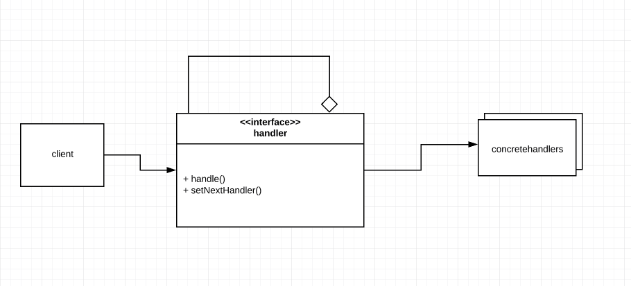

# Chain of Responsibility
This design pattern allows you pass requests along a chain of handlers. This promotes loosely coupled objects as each object passes the request to the next handler in the chain

## Main idea
- avoid attaching senders to receivers
- objects are part of a chain and they can handle request from another object independently

## When to use the pattern
- When you want objects to handle a request but the objects handling the request should do that automatically and dynamically
- hen you want to issue a request but you don't want to specify the handler

## Participants and their roles
### Participants
- Handler
- ConcreteHandler
- Client

### Roles
Handler
- defines the interface for other handlers
- optionally creates a link to the next handler

ConcreteHandler
- handles the request from the client
- has accesss to its successor
- passes request to its successor if it cannot handle request

Client
- initiates the request to an handler

## Advantages and Disadvantages
### Advantages
- Objects observe the Single Responsibility Principle
- They also observe the open closed priciple

### Disadvantages
- it is impossible to introduce this pattern into the source code without modifying it

## UML Class and Sequence Diagrams

## Implementations
- [OrderingApp](./OrderingApp/README.md)
