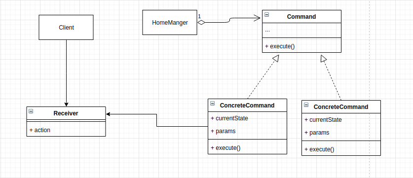

# Rental Manager App

## How this implementation achieves the command pattern
We have a RentalManger application but we dont want our manager to decide what commands he can give. We also want our commands to carry information about how it was executed and the state it holds. What we hope to achieve is to centralise our commands.

The command pattern suggests that all commands share a similar interface ensuring that the reciever can carry out its function and deliver effectively. This pattern will allow us centrallise commands in the RentalManger allowing for execution, logging and undoing of commands.

## Participants and their roles
### Participants
- Client: Client in [App.js](./App.js)
- Invoker: RentalManger in [RentalManger.js](./RentalManager.js)
- Reciever: Receiver in [Receiver.js](./Receiver.js)
- Command: Command in [Command.js](./Command.js)
- ConcreteCommand: AddApartmentCommand and DeleteAppartmentCommand in [ConcreteCommands.js](./ConcreteCommands.js)

### Roles
Client(client)
- the client creates the ConcreteCommand and sets it receiver. see `executeCommand`

Invoker(RentalManger)
- RentalManger is the invoker. This ask the command to carry out the request.

Receiver
- Defines the actions that will be carried out. The receiver does the actual work. Any class/object can serve as a receiver provided it has some operations.

Command
- Defines the interface to execute requests

ConcreteCommand
- This is where the receiver and the action binds. Execution operations are perform with this object

## UML Class and Sequence Diagrams

