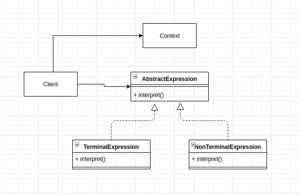

# Interpreter Pattern
This pattern suggests that given a language, define a represention for its grammar along with an interpreter that uses the representation to interpret sentences in the language.

## Main idea
- define a language represention for its grammar along with an interpreter that uses the representation to interpret sentences in the language.
- map a domain to a language, the language to a grammer and the grammer to a heirarchical object oriented design.

## When to use the pattern
- when you want to define your grammar, tokenize inputs and store it
- when you want to define rules for a language
- when you want to add functionality to a composite pattern

## Participants and their roles
### Participants
- AbstractExpression
- TerminalExpression
- NonTerminalExpression
- Context
- Client

### Roles
AbstractExpression
- declares an abstract interpret operation

TerminalExpression
- implements an interpret operation
- every symbol in a sentence has an instance

NonTerminalExpression
- implements an interpret operation for non-terminal symbols

Context
- contains information that's global to the interpreter

Client
- invokes the interpret operation
- builds (or is given) a syntax tree representing the grammar

## Advantages and Disadvantages
### Advantages
- it makes it easy to express a language

### Disadvantages
- it is hard to manage and maintain

## UML Class and Sequence Diagrams

## Implementations
- [Text Calculator](./Text_Calculator/README.md)
