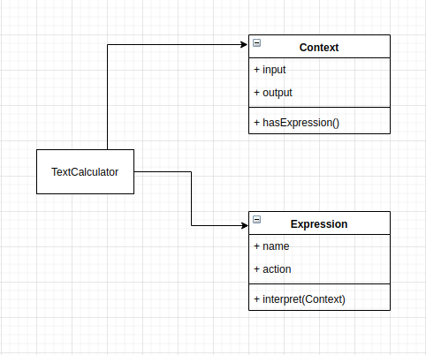

# Text Calculator

## How this implementation achieves the Interpreter Pattern
- This program is able to read the language('add', 'multiply' etc) and it uses the representation(Expression) to interpret the sentences to provide an output

## Paticipants and their Roles
### Participants
- AbstractExpression: Not applicable
- TerminalExpression: Expression in [Expression.js](./Expression.js);
- NonTerminalExpression: Not applicable
- Context: Context in [Context.js](./Context.js)
- Client: TextCalculator in [App.js](./App.js)

### Roles
TerminalExpression(Expression)
- implements an interpret operation

Context
- Contain information(output and hasExpression) that is global to interpreter

Client(TextCalculator)
- invokes the interpret operation
- builds a syntax tree representing the grammar

## UML Class and Sequence Diagrams

