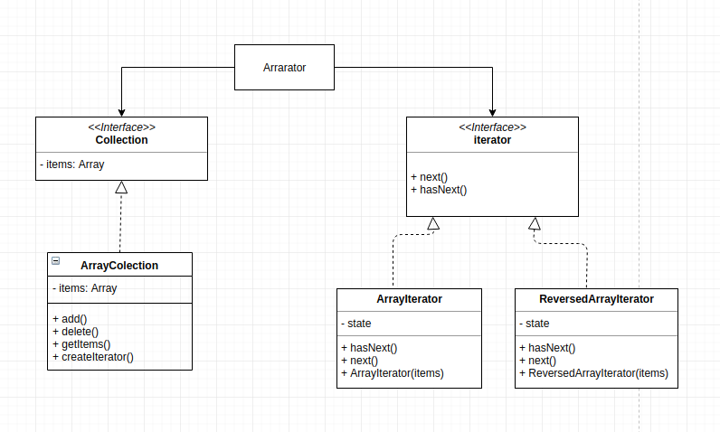

# Arrarator

## How this implemanetation achieves the pattern
- we have an Array collection but we need a way to traverse the array. 
- the `ArrayIterator` and the `ReversedArrayIterator` serves as the iterator for our collection.
- Collections can make use of any iterators

## Participants and their Roles
### Participants
- Iterator: Iterator in [iterator.js](./iterator.js)
- ConcreteIterator: ArrayIteraror and ReverseArrayIteraror in [iterator.js](./iterator.js)
- Collection: Collection in [Aggregate.js](./Aggregate.js)
- ConcreteCollection: ArrayCollection in [Aggregate.js](./Aggregate.js)

### Roles
Iterator(iterator)
- this defines the interface for the iterator

ConcreteIterator(ArrayIterator and ReversedArrayiterator)
- this implements the iterator interface and keeps track of its state while it traverses the collection  

Aggregate(Collection)
- defines the collection interface

ConcreteAggregate(ArrayCollection)
- implements the collection interface and returns and iterator for the collection

## UML Class and Sequence Diagrams

