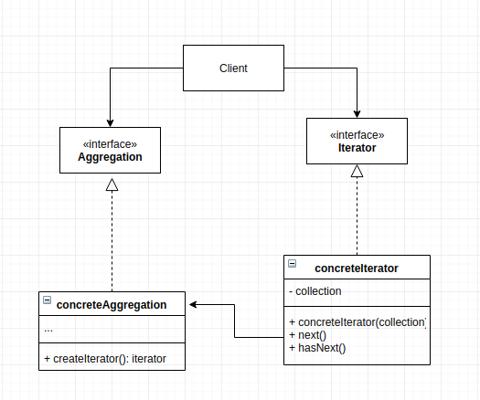

# Iterator Pattern
As applciations grow, we begin to compose objects into collections. The iterator pattern provides a way to access these elements sequentiontially without exposing its underlying representation.

## Main idea
- provide a way to access the elements of an aggregate object sequentially without exposing its underlying representation.

## When to use the pattern
- to access aggregate object without exposing its internal representation
- to support multiple travesals of aggregate objects
- when you want to have a uniform interface for traversing different aggregate structures

## Participants and their roles
### Participants
- Iterator
- ConcreteIterator
- Aggregate
- ConcreteAggregate

### Roles
Iterator
- defines the interface for traversing and accessing the elements

ConcreteIterator
- impements the iterator interface
- keeps track of the current position in the traversal of the aggregate

Aggregate
- defines the interface for creating an iterator object(iterable object)

ConcreteAggregate
- implements the Iterator creation interface to return an instance of the proper ConcreteIterator.

## Advantages and Disadvantages
### Advantages
- it observes the Single Responsibility Principle
- It also observes the closed principle 
- colections can iterated over in parallel
- iterations over collection can be delayed and resumed at anytime.

### Disadvantages
- This can be an overkill to a simple collection
- sometimes, using an iterator may no bbe as efficient as accessing objects directly

## UML Class and Sequence Diagrams

## Implementations
- [Arrarator](./Arrarator/README.md)