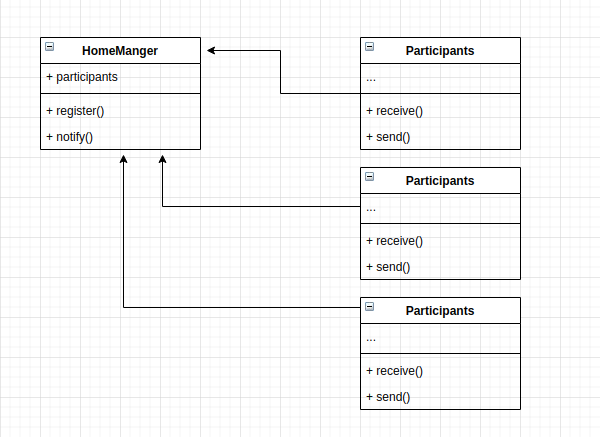

# Home Manager

## How this implementation achieves the Mediator Pattern
- the HomeManager app acts as a mediator between homes and different services

The application allows homes to be able to connect to clients that will render this house services such as home cleaning, babysitting, car washing, house repairs, gardening, and many more services. There can be problems for both parties such as: 
- the homes may request the service of a client that is under contract with another home causing conflict
- clients and homes will get tightly coupled making it difficult to extend the services

The mediator pattern suggests that a class/object should exist between homes and clients. This way, the mediator can manage requests of clients effectively without conflicts and the can provide services to all clients in a category provided they share the same interface.

## Participants and thier Roles
### Participants
- Mediator: Meidiator in [Mediator.js](./Mediator.js)
- ConcreteMediator: Not applicable
- Colleague: Participant in [Participant.js](./Participant.js)

### Roles
Mediator
- defines the interface for which the participants(Colleagues) will communicate

Colleague(Participants)
- this knows its mediator therefore communicates directly with it instead of its other participants

## UML Class and Sequence Diagrams

