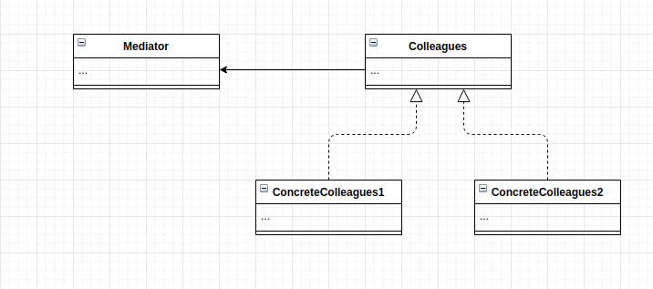

# Mediator Pattern
The mediator pattern acts as a communication controller between unrelated classes/objects. It aims at reducing the chaotic dependencies between objects by forcing these objects to communicate only via the mediator object. The mediator is able to achieve this because it exposes unified interface through which the different parts of the system can commuincate. *The Mediator promotes loose coupling by ensuring that instead of modules referring to each other explicitly, their interaction is handled through this central point.

A typical real world analogy is the airport traffic system. The tower(mediator) handles what planes(classes/objects) can take off or land. These planes commuicate with the tower rather than plane-to-plane. This centralised control system is what makes this pattern successful.

The mediator pattern in systems are the central points of contacts that maintain order.

## Main Idea
- promote loose coupling
- interaction is varied independently

## When to use this pattern

- When you want to reuse an object and notice this is difficult because it refers to/ depends on many other objects.
- When there is a behaviour that is shared amongs many objects you aim to modify it without having to do alot of subclassing.
- When you want to change some of the classes but you they are tightly coupled with other objects

## Implementaion
- [Mediator](./Mediator.js)
- [Participant](./Participant.js)
- [Home Manger App](./HomeManager.js)

## Participants and their roles
### Participants
- Mediator
- ConcreteMediator
- Colleague

### Roles
Mediator
- defines the interface for which the participants(Colleagues) will communicate

ConcreteMediator
- this is the concrete class of the Mediator, it implements and ensures coorporation between paricipants by providing a shared interface.

Colleague
- this class/object knows its mediator therfore communicates directly with it instead of its other participants

## Advantages and Disadvantages
### Advantages
- Single Responsibility Principle
- Open/Closed principle
- Coupling between components are reduced
- individual components can be reused more easily

### Disadvantages
- A Mediator if not implemented properly can introduce another level of complexity
- The mediator can become a 'god' like class/object
- making it hard to maintain overtime

## UML Class and Sequence Diagrams

## Implementations
- [Home Manager](./HomeManger/README.md)
