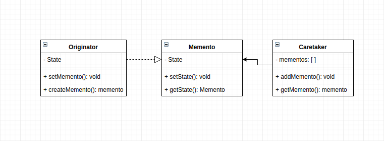

# Moment App

## How this implementation achieves the Momento Patter
- moments of the persons are bieng saved and caputured, and this gives us the ability restore the state.

## Participants and their Roles
### Participants
- Originator: Originator in [Originator.js](./Originator.js)
- Memento: Momento in [Memento.js](./Memento.js)
- Caretaker: Caretaker in [Caretaker.js](./Caretaker.js)

### Roles
Originator
- creates a memento object by capturing its own internal state
- uses the memento to restore to a previous state

Memento
- stores the internal state of the originator object
- has an interfaces for which the  originator can use in restoring states.

Caretaker
- responsible for storing and managing the mementos

## UML Class and Sequence Diagrams

