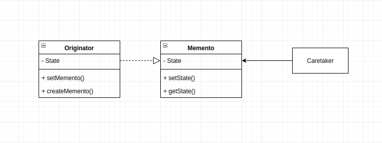

# Memento
This design pattern allows you capture , store and restore the state of an object without violating encapsulation. This can come in really handy in situation where you have an error and you want to restore the object back to its original state. Asides this, there are more situations where the memento pattern is really helpful: Eg Undo operations.

## Main Idea
- capture the internal state so that the object can be returned to this state later

## When to use the pattern
- when you want to restore an object back to its previous state and you don't want to violate encapsulation

## Participants and their roles
### Paticipants
- Originator
- Memento
- Caretaker

### Roles
Originator
- creates a memento object by capturing its own internal state
- uses the memento to restore to a previous state

Memento
- stores the internal state of the originator object
- has interfaces for which the caretaker and originator can use for storing and restoring states respectively. To ensure encapsulation is not violated, these interfaces should not be able to access memento state to perform operations.

Caretaker
- responsible for keeping and managing the mementos

## Advantages and Disadvantages
### Advantages
- does not violate the encapsulation principle

### Disadvantages
- alot of RAM is required if the mementos are created more than usual

## UML Class and Sequence Diagrams

## Implementations
- 
