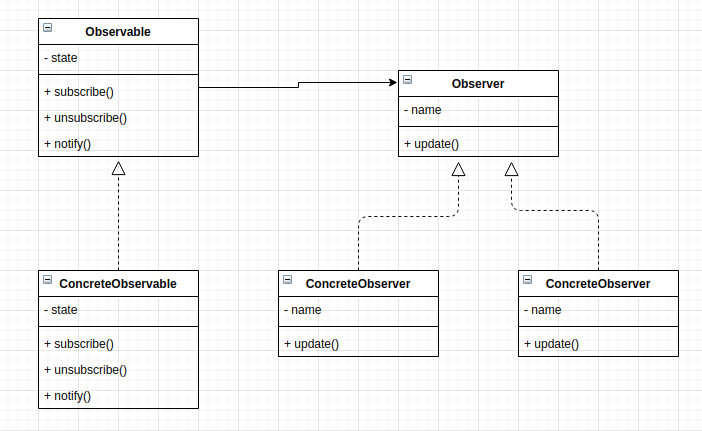

# Observer Pattern
This pattern allows a collection of object to watch an object and be notified of changes. It defines a one-to-many dependency between objects so that when the one object changes all its dependecies are notified and updated automatically. The observer pattern is also known as 'Dependants' or 'Publish-Subscribe'. Subscribers are ale to subcribe(register) to a publisher to recieve notifications when somthing happens. The pubslisher is also able to publish (broadcasts) notifications to the observer. Subscribers can unsubsrie(unregister) from the publishers' collections.

This pattern is the connerstone for event driven programming including JavaScript.

The main aim of the observer pattern is to promote loose coupling, break down apllication into smaller modules and achieve manageability. This pattern provides an efficient medium for the relationships between differnt part of your application.

## Main Idea
- defines a one-to-many dependency between objects so that when one object changes state, all its dependents are notified and updated automatically.

## When to use this pattern
- when an abstraction has two aspects, one dependent on the other.Encapsulating these aspects in separate objects lets you vary and reuse them independently.
- when a change to one object requires changing others, and you don't know how many objects need to be changed.
- when an object should be able to notify other objects without making assumptions about who these objects are. In other words, you don't want these objects tightly coupled.

## Participants and their roles
### Participants
- Observable
- ConcreteObservable
- Observer
- ConcreteObserver

### Roles
Observable
- This provides an interface for subscribing, unsuscribing and notifying the subscribers. It knows about the observers

ConcreteObservable
- implements the observable interface
- maintains it own state a notifies the observers of state change

Observer
- This defines an interface for classes/objects that should be notified when a change has occured.

ConcreteObserver
- implements the observer interface

## Advantages and Disadvantages
### Advantages
- Promotes loose coupling
- Open/Closed Principle
- Relations can be established at runtime

### Disadvantages
- Classes involved in the Observer pattern tends to be loosely coupled. This can cause some unexpected updates when the Observable's state changes, the notify function is called without the intention of notifying the users.

## UML Class and Sequence Diagrams

## Implementations
- [News App](./News_App/README.md)
