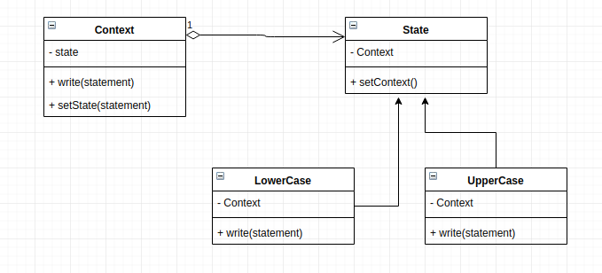

# Case App

## How this implementation achieves the State Pattern
- at runtime, this app is able to change it behaviour when an operation(`write`) is called in its context. Lowercase for defaults then it changes to Uppercase. Uppercase state is used twice and then it is changes it state to LowerCase.

## Participants and their Roles
### Participants
- Context: Context in [Context.js](./Context.js);
- State: State in [State.js](./State.js);
- ConcreteState: LowerCaseState, UpperCaseState in [ConcreteState.js](./ConcreteState.js);

### Roles
Context
- maintains a reference to LowerCaseState and UppeerCaseState.
- exposes an interface to change state `setState`

State
- defines a common interface for the concrete state `setContext`

ConcreteState
- implements the state interface and implements it own unique logic on write function
- maintains a reference to the context to be able to update its context

## UML Class and Sequence Diagrams
