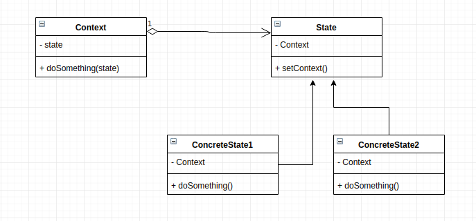

# State
This design pattern allows an object to alter its behaviour when its internal state changes. It appears as if the object has changed class. The behaviour of the object is changed at run-time depending on its state. This is quite useful if an application has a lot of case statements and operations are done based on the state of the application. An example of this is the typical TCP connection that has different state; Open, Establised, Closed etc.

## Main Idea
- allow an object to alter its behavior when its internal state changes. The object will appear to change its class

## When to use the pattern
- when you have an object that frequently behaves differently depending on its state
- when you have operation that have large condiional statements and this operations depends on the objects state

## Participants and their roles
### Participants
- Context
- State
- ConcereteState

### Roles
Context
- maintains a reference to one of the concrete states.
- exposes an interface to change state

State
- defines an inteface for the concrete states

Concrete State
- implements the state interface and implements it own unique logic when that state is in context
- maintains a reference to the context to be able to get some imformation from the context

## Advantages and Disadvantages
### Advantages
- maintains the single responsibility principle
- maintains the open closed principle by introducing new states without changing existing state classes or context
- simplfies code by eliminating case statements

### Disadvantages
- this pattern might be an overkill if a state machine(the object) has only a few states or rarely changes

## UML Class and Sequence Diagrams

## Implementations
- [Case App](./Case_App/README.md)

