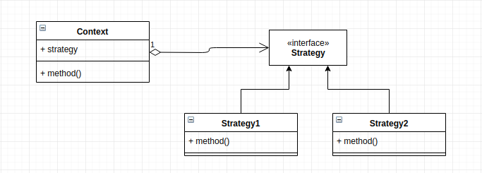

# Strategy Pattern
This design pattern lets you define a family of algorithms, put each of them into a special class and make thier object interchangeable. Strategy pattern suggests that your take a class that does something specific and alot of different ways and extract all the algorithms into seperate classes called strategies. The context must have a field for storing reference to one of the strategies.

## Main idea
- define a family of algorithms, encapsulate each one, and make them interchangeable. Strategy lets the algorithm vary independently from clients that use it.

## When to use the pattern
- when you want switch algorithms in runtime and you want to have different variants of algorithms
- when you have many related classes but they differ in their behaviours
- when an algorithm uses data that clients should not know about. This pattern helps in avoiding exposure of complex, algorithm-specific data stuctures
- when you have many conditions, move related conditional into their own strategy class.

## Particpants and their roles
### Particpants
- Strategy
- ConcreteStrategy
- Context

### Roles
Strategy
- defines the interface common for all supported algorithms.

ConcreteStrategy
- implement the algorithm using the strategy interface

Context
- MAY define an interface that lets strategy access its data
- maintains a reference to a strategy object
- is configured with a concrete strategy object

## Advantages and Disadvantages
### Advantages
- Algorithms can be swapped at runtime
- implementation details is isolated
- compositon over inheritance
- open/closed principle. You can introduce new strategies without having to change the content

### Disadvantages
- over-complication if algorithms rearly change
- clients must be aware of the differences between strategies to be able to select a proper one
- you might be rebuilding the wheel if your programming language already supports the strategy

## UML Class and Sequence Diagrams

## Implementations
- [Sorter](./Sorter/README.md)
