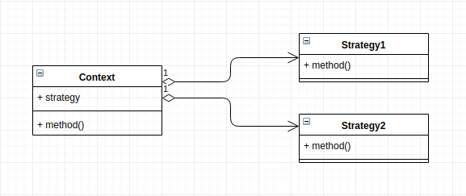

# Sorter

## How this implementation achieves the Stategy Pattern
- we are able to define a family of sorting algorithms and use them is a special class(Context)

## Participants and their Roles
### Participants
- Context: Context in [Context.js](./Context.js);
- Strategy: not in use
- ConcreteStrategy: BubbleSort and MergeSort in [Strategy.js](./Strategy.js)

### Roles
Context
- maintains a refernce to the strategy object
- is configured with the strategy using `setStrategy`

ConcreteStategy
- implements the algorithm

## UML Class and Sequence Diagrams

