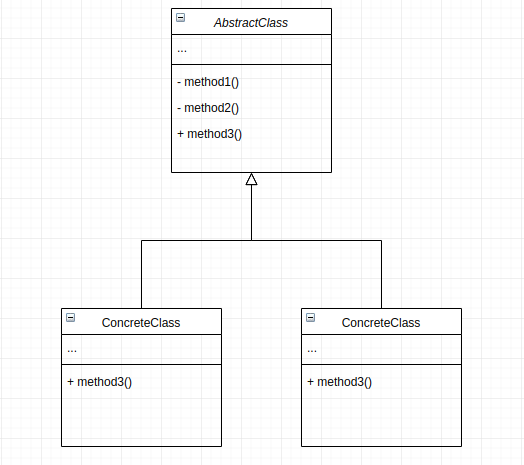

# Template Method Pattern
This design pattern defines the skeleton on an algorithm in the superclass but lets subclasses overide specific steps of the algorithm without changing its structure.

## Main Idea
- define the skelenton of an algorithms in an operation, deferring some steps to  the subclasses.
- lets subclasses redefine steps of an algorithm without letting them to change an algorithm structure.

## When to use the pattern
- use this pattern if you want the clients to extend only paticular steps of an algorithm, but not the whole structure
- when you have several classes that contain almost identical algorithms with some minor differences

## Participants and their roles
### Participants
- AbstractClass
- ConcreteClass

### Roles
AbstractClass
- define the primitibe operation that concrete classes will define.
- implements a template method defining the skeleton of an algorithm. The template method call primitive opreations as well as operations defined in abstract class or those of other objects.

ConcreteClass
- implements the primitive operations to carry out the subclass specific steps of the algorithm.

## Advantages and Disadvantages
### Advantages
- clients can change certain parts of the larger algorithm which reduces part of the algorithm
- less code duplication

### Disadvantages
- some clients are limited by the provided skelenton algorithm
- one might violate the Liskov Substitution Principle by suppressing a default step implemented via a subclass
- this pattern becomes harder to maintain the more steps they have

## UML Class and Sequence Diagrams

## Implimentations
- [Shipping App](./Shipping_App/README.md)

