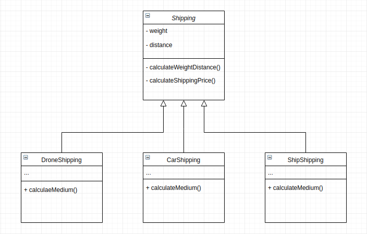

# Shipping App

## How this implementation achieves the Template Method Pattern
- the shipping class implements the primitive algorithms which are `calculateWeightDistance` and `calculateShippingPrice` but defers the implementation of `calculateMedium` to the subclasses.

## Participants and their Roles
### Participants
- AbstractClass: Shipping in [Shipping.js](./Shipping.js)
- ConcreteClass: DroneShipping, CarShipping and ShipShipping in [Shipping.js](./Shipping.js)

### Roles
AbstractClass(Shipping)
- provides the primitive algorithms 
- implements a template method

ConcreteClass(DroneShipping, CarShipping, ShipShipping)
- implemtents the primitive oprations from Shipping
- defines it's own algorithms for `calculateMedium`

## UML Class and Sequence Diagrams

