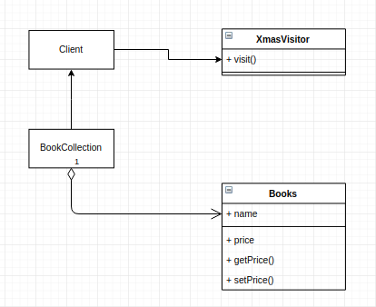

# BookSeller

## How this implementation achieves the Visitor Pattern
- `xmasvisitor` is the visitor and Books is the visitable object. The visitible object allows a visitor to be operate on its self.

## Participants and their Roles
### Participants
- Visitor: Not applicable
- ConcreteVisitor: XmasVisitor in [Visitor.js](./Visitor.js)
- Element: Not applicable
- ConcreteElement: Books in [Books.js](./Books.js)
- ObjectStructure: BookCollection in [Books.js](./Books.js)

### Roles
ConcreteVisitor(XmasVisitor)
- defines the visit method

ConcreteElement(Books)
- defines the accept method. All visitors will be passed the accept method

ObjectStructure(BookCollection)
- contains all the objects that can be visited

## UML Class and Sequence Diagrams

