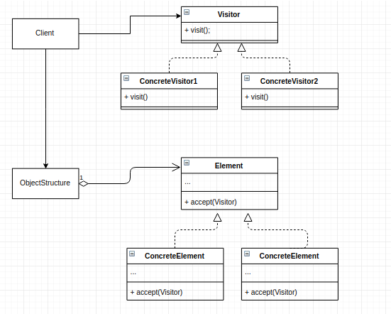

# Visitor Pattern
This pattern lets you seperate algorithms from the objects on which they operate.

## Main Idea
- represent an operation to be performed on the elment of an object structure
- visitor lets you define a new operation without changing the classes of the elements on which it operates.

## When to use the pattern
- similar operations have to be performed on objects of different types grouped in a structure(a collection)
- the object structure is not likely to be changed but is very probable to have new operations which have to be added
- visitor pattern allows us to create seperate visitor for each type of operatioon and to seperate this operation implementation from the object structure

## Participants and thier roles
### Participants
- Visitor
- ConcreteVisitor
- Element
- ConcreteElement
- ObjectStructure

### Roles
Visitor
- an interface or an abstract class used to declare the visit operation for all the types of visitable classes. Usually, the name of the operation is the same and the operation are differntiated by the method signature. The input oject type decides which of the method is called.

ConcreteVisitor
- all types of visitors implements the visit method. Each method will be responsible for different operations

Element
- an abstraction which declares the accept operation. This is the entry point which enables an object to be visited by visitor object. Each obejct in the object structure should implement this abstraction in order to be able to visited.

ConcreteElement
- implements the element interface or class defines the accept operation. The visitor object is passed to the object using the accept operation.

OjectStructure
- contains all the objects that can be visited. It offers mechanism to iterate through all elemtents.

## Advantages and Disadvantages
### Advantages
- open/closed principle, introducing changes to a class without changing the class
- single responsibility, you can move multiple versions of the same behaviour into the same class

### Disadvantages
- All visitors must be updated each time a class object gets added to or removed from the element heirachy
- visitors might lack the necessary access to the provate fields and methos of the elments that they supposed to work with

## UML Class and Sequence Diagrams

## Implementations
- [BookSeller](./BookSeller/README.md)
