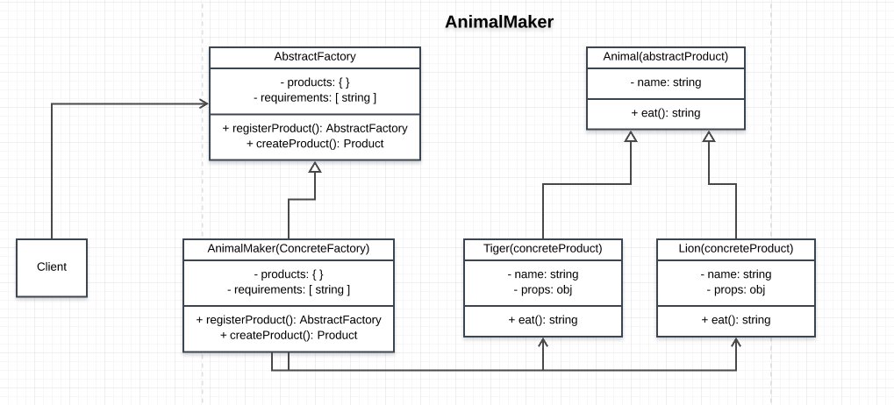

# Animal Maker

## How the Abstract Factory is achieved
- an interface for creating animals is provided by the Abstract Factory class
- products share similar properties


## Participants and their roles
### Participants
- AbstractFactory: ```AbstractFactory``` in [AbstractFactory.js](./AbstractFactory.js)
- ConcreteFactory: ```AnimalMaker``` in [App.js](./App.js)
- AbstractProduct: ```Animal``` in [AbstractProduct.js](./AbstractProducts.js)
- ConcreteProduct: ```Lion``` and ```Tiger```  in [AbstractProduct.js](./AbstractProducts.js)
- Client: [App.js](./App.js)

### Roles
AbstractFactory
- defines the interface for creating product(animals)

ConcreteFactory(AnimalMaker)
- implements the Abstactfactory interface

AbstractProduct(Animal)
- defines the interface for the animals

ConcreteProduct(Lion, Tiger)
- implements the Animal interface

Client
- implemets the inteface to wherby a object and create other objects 

## UML Class Diagram

