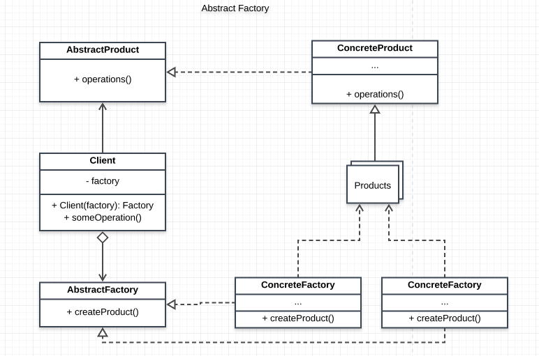

# Abstract Factory Pattern

The aim of the Abstract Factory Pattern is provide an interface for creating families of related or dependent objects without specifying their concrete classes. 

Over time the Abstract Factory and Factory Method patterns have merged into a more general pattern called Factory. A Factory is simply an object that creates other objects.

Why would you want to use a factory? The reason is that that constructor functions are limited in their control over the overall creation process and sometimes you will need to hand over control to a factory that has broader knowledge. This includes scenarios in which the creation process involves object caching, sharing or re-using of objects, complex logic, or applications that maintain object and type counts, and objects that interact with different resources or devices. If your application needs more control over the object creation process, consider using a Factory.

One way this familes can be acheived is by making the Factory families accept/register only products/factories that meet their requirement.

Think of the Abstract factory as a factory that creates other factories

## Main idea
- Abstract Factory offers the interface for creating a family of related objects, without explicitly specifying their classes

## When to use the pattern
- When you want the system to have products that are independent of its compositions, representations and creation process
- when you want a factory of objects that strictly share an interface and should be used together
- when you want your system to be made up of products that reveal just thier interfaces and not their implementation

## Participants and their roles
- AbstractFactory
- ConcreteFactory
- AbstractProduct
- ConcreteProduct
- Client 

AbstractFactory
- defines an interface for operations of creating factory products

ConcreteFactory
- implements the operations of creating concrete products

AbstractProduct
- declares an interface for a type of product

ConcreteProduct
- implement its AbractProduct interface
- defines the object that will be created by the ConcreteFactory

Client
- uses only interfaces decleared by the AbstractFactory and the AbstractProduct

## Advantages and Disadvantages

## Advantages
- It gives great control of the classes/objects that are created
- Due to the fimiliarity amongs families, consistensy is promoted

## Disadvantages
- It may be difficult to support new products

## UML Class and Sequence Diagrams

### Class Diagram

## Implementations
- [AnimalMaker](./AnimalMaker/README.md)
