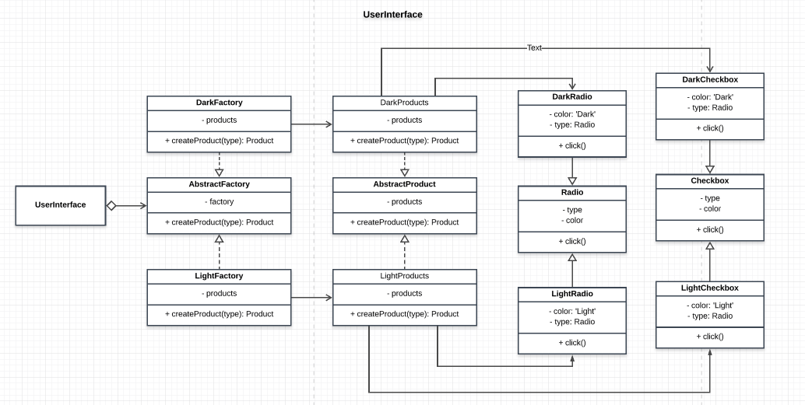

# UserInterface

## How the Abstract Factory is achieved
- an interface for creating components is provided by the Abstract Factory class
- products share similar properties. 


## Participants and their roles
### Participants
- AbstractFactory: ```AbstractFactory``` in [Factories.js](./Factories.js)
- ConcreteFactory: ```DarkFactory``` and ```LightFactory``` in [App.js](./App.js)
- AbstractProduct: ```AbstractProduct``` in [AbstractProduct.js](./AbstractProduct.js)
- ConcreteProduct: ```DarkProducts``` and ```LightProducts``` in [App.js](./App.js) or [Products.js](./Products.js)
- Client: ```UserInterface``` in [App.js](./App.js)

### Roles
AbstractFactory
- defines the interface for creating the products i.e Radio or Checkbox component

ConcreteFactory(DarkFactory, LightFactory)
- implements the Abstactfactory interface and is ready to be used by the client

AbstractProduct
- defines the interface for the products
- ensures that the products that are being registered to its collections have similar structure

ConcreteProduct(DarkProducts, LightProducts)
- implements the AbstractProduct interface

Client(UserInterface)
- uses only the inteface declared by the AbstractFactory and the AbstractProduct eg: ```createProduct('Radio')``` 

## UML Class Diagram

