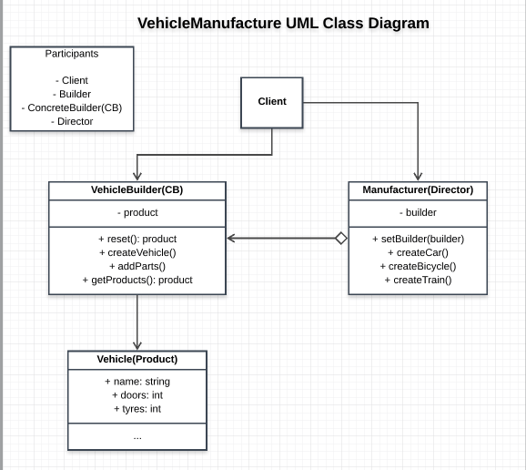
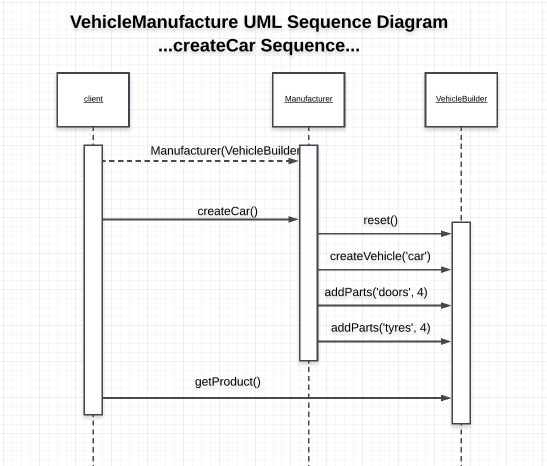

# VehicleManufacturer

## Participants and their roles
### Participants
- Builder: JavaScript has no Abstract class implementation
- ConcreteBuilder: VehicleBuilder in ([Builders.js](./Builders.js))
- Director: Manufacturer([VehicleM.js](./VehicleM.js))
- Product: Vehicle in ([Builders.js](./Builders.js))

### Roles
ConcreteBuilder(VehicleBuilder)
- responible for constructing the and assembly of the product by providing an interface for implementation
- provides a interface to retrieve the vehicle: ```getProduct()```
- keeps track of the representation it creates

Director(App)
- constructs the vehicles using the VehicleBuilder interface

Product(Vehicle)
- This is the complex object to be created or under-construction
- The Vehicle class could include an interfaces that assist in its assembling

### UML Class Diagram


### UML Sequence Diagram

