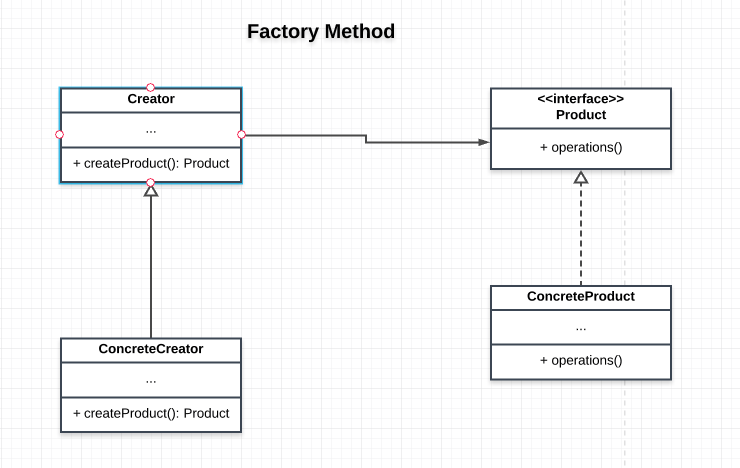

# Factory Method Pattern

This pattern simplies the object creation process. It creates objects based on need. In the process of creating the products, extra logic can performed such as caching, applying configuration the products and core business logic can be implemented.

## Main idea
- to define an interface for creating objects
- simplifies the object creation process

## When to use Factory Method Pattern
- when a class cannot anticipate the class of objects it will create.
- when you want a process whereby a class/ object can specify a type of object it needs and create it.

## Participants and their roles
- Product
- ConcreteProduct
- Creator
- ConcreteCreator

Product
- defines the interface of objects the factory method creates

ConcreteProduct
- implements the product interface

Creator
- defines the factory method for creating Products. The creator may define a default interface that returns concrete products

ConcreteCreator
- defines a method that may overide the factory method for creating products

## Advantages and Diadvantages

### Advantages
- The enviroment determines the type object that we create
- The objects being created can share silimar properties since they go through the same cration process
- It is useful for decoupling which means that a change in one product does not affect the other
- It helps in the process composing objects/classes from two or more classes

The factory class/object is responsible for the creation of objects(Products).

### Disadvantages

- The client code will expect all the products of the factory to share some similar interface with the factory.
- This pattern can also add unnecessary complexity and make it difficult to test.
 

## UML Class and Sequence Diagram
### Class Diagram

### Sequence Diagram
...

A more advanced Factory Method Pattern is the [Abstract Factory Pattern](../Abstract_Factory_Pattern/README.md).

