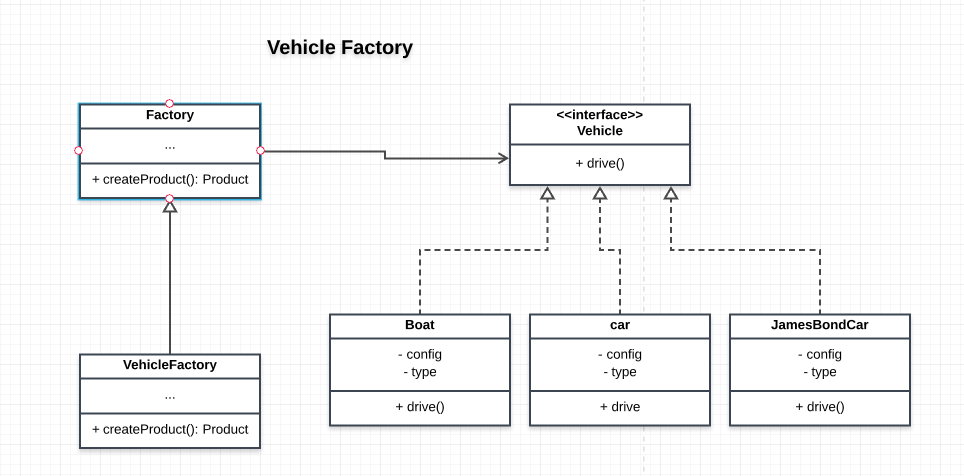

# Vehicle Factory

## How the Factory Method Pattern is achieved
- an interface for creating objects is implemented on the Vechicle factory function that was created


## Participants and their roles
### Participants
- Creator: ```Factory``` in [Factory.js](./Factory.js)
- ConcreteCreator: ```VehicleFactory``` in [App.js](./App.js)
- Product: ```Vehicle``` in [Products.js](./Products.js)
- ConcreteProduct: ```Boat```, ```Car``` and ```JamesBondCar``` in [Products.js](./Products.js)

### Roles
Creator(Factory)
- defines the interface for creating vehicles

ConceteCreator(VehicleFacory)
- implements the factory interface

Product(Vehicle)
- defines the interface for the objects the Factory creates

ConcreteProduct(Car, Boat, JamesBondCar)
- implements the Vehicle interface

## UML Class Diagram

