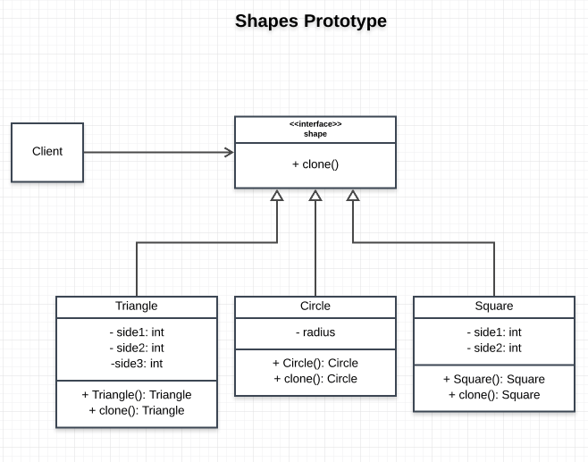

# Shapes

## How the Prototype pattern is achieved
- we have been able to reduce the instantion process of creating a new shape
- we can make copies of the shapes by using the clone method
- every shape can make a clone of itself
- every shape class is independent of how it is created it just shares a clone interface

## Participants and their roles
### Participants
- Client: App.js
- Prototype: [Shape.js](./Shape.js)
- ConcretePrototype: Circle, Triangle and Square in [ConcreteShapes.js](./ConcreteShapes.js)

### Roles
Client(App.js)
- creates a new shape by asking circle to clone itself

Prototype(Shape)
- defines interface to clone itself

ConcretePrototype(Circle)
- has the operation to clone itself

### UML Class Diagram
