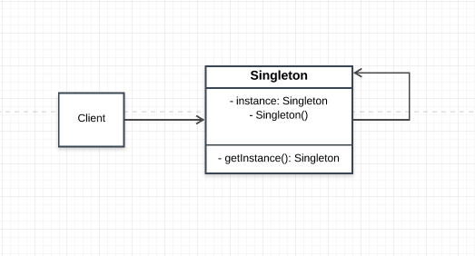

# Singleton Pattern

This pattern ensures that only one instance is created across the application. The application has access to the state and resources of the singleton instance. The singleton ensures that no other instance is created and resourecs and state are not shared or altered. The singleton provides methods that accept request to send, store or retreive from its state. This pattern violates the Single Responsiblitiy Principle i.e an object must do one thing/have a single responsiblity.

## Main idea
- to restrict the amount of instances created for an oject
- provide global access point for other classes/objects in the application

NB: Some of the problems that a singleton solves can also be solved with other techniques.

## When to use Singleton Pattern
- When you want only one instance of a class and you want it to be accessible from all points of the system
- To acheive a strict global variable system

## Participants and their roles
- Singleton

Singleton
- This is responsible for storing it's instance and providing an operation for the client to access its instance/state

## Advantages and Disadvantges

### Advantages
- Controlled access to the sole instance
- Reduced name space
- Allows for refinment of its operation and representation when subclassed

### Disadvantages
- Violates the Single Responsibility Princible

## UML Class and Sequence Diagram
### Class Diagram

### Sequence Diagram
**Null**