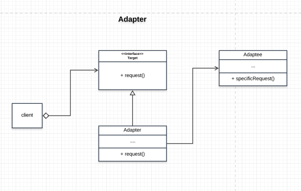

# Adapter Pattern

Adapter pattern is a pattern that lets classes with incompatible interfaces collaborate. The adapter is also referred to as the wrapper pattern. 

## Main idea
- converts the interface of a class into another interface the client expects making classes compatible with other classes hence promoting cohesion amongs classes/objects

## When to use the pattern
- when you have a class/service that is not compatible with your client code
- when you are making use of a 3rd party application

## Participants and their roles
- Target
- Adaptee
- Adapter
- Client

Target
- defines the domain-specific interface the client uses

Adaptee
- defines the interface for the adapter

Adapter
- apdapts the interface Adaptee to the Target interface

Client
- collaborates with object conforming to the target interface

## Advantages and Disadvantages
### Advantages
- interface can be seperated from the business logic
- adapters can be introduced into the program without breaking the existing client code

### Disadvantages
- overall complexity of the code increases

## UML Class and Sequence Diagrams

## Implementations