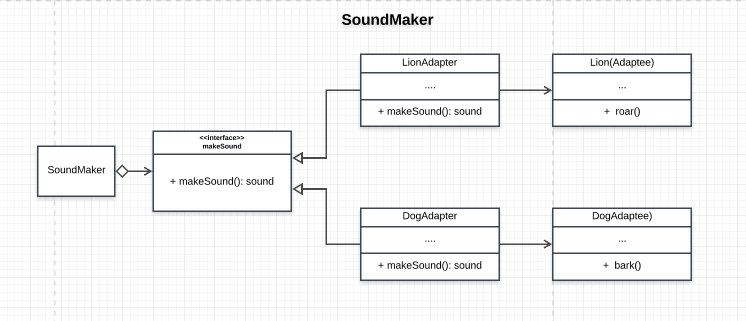

# SoundMaker

## How the Adapter Pattern is achieved
- The Soundmaker app is able to collaborate with Lion and Dog class through their adapters even though interface is not the same

## Participants and thier roles
### Participants
- Client: ```SoundMakerApp``` in [App.js](./App.js)
- Target: ```MakeSound``` in [AnimalAdapter](./AnimalAdapter.js)
- Adaptee: ```Lion``` and ```Dog``` in [Animals.js](./Animals.js)
- Adapter: ```LionAdapter``` and ```DogAdapter``` in [AnimalAdapter](./AnimalAdapter.js)

### Roles
Client(SoundMakerApp)
- collarborates the `makeSound` interface

Target(makeSound)
- defines the domain-specific interface the client uses

Adpatee(Lion and Dog)
- defines the interface for the adapter

Adapter(LionAdapter and DogAdapter)
- adpats unique sound of each animal to the tagart so the Client can collaborate effectively

### UML Class Diagram
