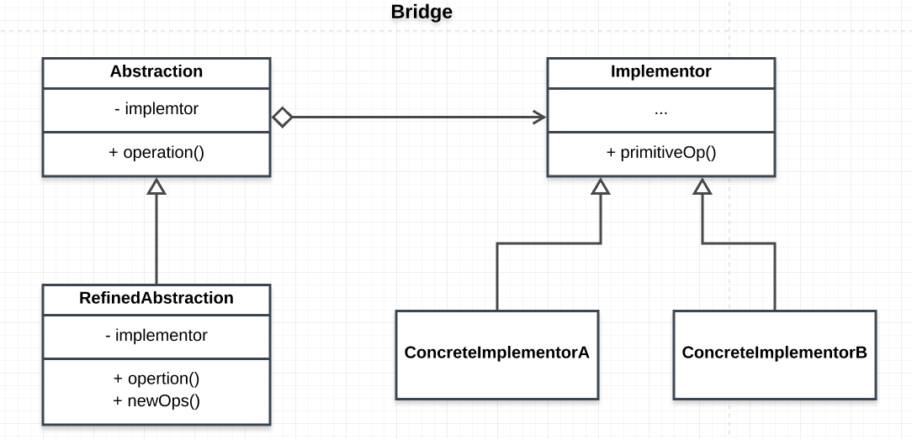

# Bridge 

This pattern allows for the decoupling of an abstraction from its implementation so that they can vary independently

## Main idea

- this pattern aims at decoupling an abstraction from implementation so that the two can vary independently.

## When to use the pattern
- when you want to avoid a permanent binding of an abstraction and its implementation.
- when you want both the abstraction and the implementation to be extensible without them affecting one another
- when you want to avoid breaking changes to the abstraction when the implementation changes
- when you want to hide the implemention of the abstraction completely from the client
- when you want to share implementation amongs clients

## Participants and their roles
### Participants
- Abstraction
- RefinedAbstraction
- Implementor
- ConcreteImplementor

### Roles
Abstraction
- defines the abstraction inteface

RefinedAbstraction
- implements and extends the abstraction interface

Implementor
- defines the implementation interface
- this provides primitive for the abstraction

ConcreteImplementor
- implements the implementor interface and defines its implementation

## Advantages and Disadvantages
### Advantages
- interface and implementation is decoupled
- ease of extensibility
- core abstraction(hiding the implementation from the client)

### Disadvantage
- might make the code more complex

## UML Class and Sequence Diagrams

## Implementations
- [RemoteApp](./RemoteApp/README.md)
