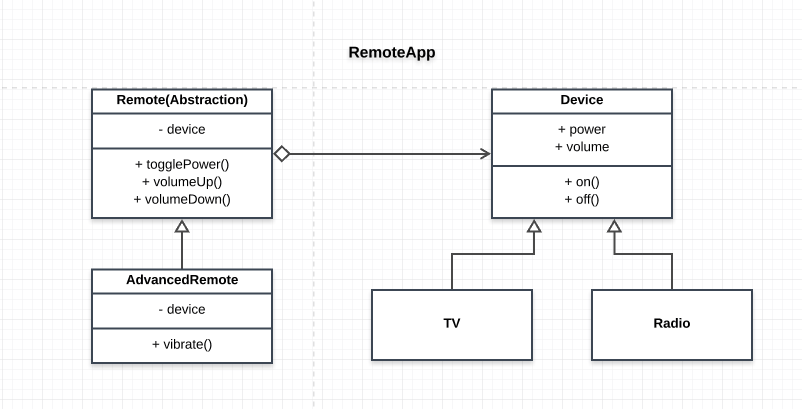

# RemoteApp

## How the Bridge Pattern is achieved
- The device implementation is independent of the remote abstraction making it decoupled
- The device can easily be extended, just as we have extended it with `PowerLogic` and `VolumeLogic`
- The abstraction(remote) is able to make use of the primitive interface provide by the implementaion(device)

## Participants and their roles
### Participants
- Abstraction: ```Remote``` in [Abstraction.js](./Abstraction.js)
- RefinedAbstraction: ```AdvanceRemote``` in [Abstraction.js](./Abstraction.js)
- Implementor: ```Device``` in [Implementor.js](./Implementor.js)
- ConcreteImplementor: ```TV``` and ```Radio``` in [Implementor.js](./Implementor.js)

### Roles
Abstraction(Remote)
- defines the astraction interface
- maintains a reference to Device implementation

RefinedAbstraction(AdvancedRemote)
- extends the abstraction(Remote) interface with the `Vibrate` functionality

Implementor(Device)
- defines the interface for implementation. The Device class defines a primitive Power and volume interface

ConcreteImplementor(Tv and Radio)
- implements the device interface

### UML Class Diagram

