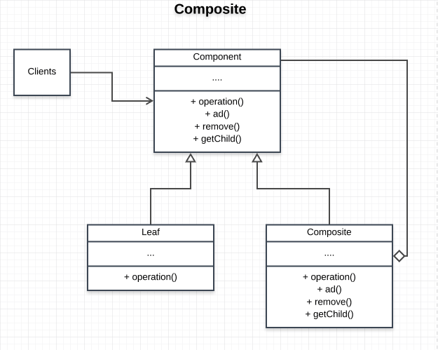

# Composite Pattern
Composite is a structural design pattern that lets you compose objects into tree structures and then work with these structures as if they were individual objects. In that tree, each node/object (except root node) is either composite or leaf node.

## Main Idea
- objects are compsed into tree structures to represent part-whole hierarchies
- Composite lets clients treat individual objects and compositions of objects uniformly.

## When to use this pattern
- when you want to represent part-whole hierarchies of objects.
- wheb you want clients to be able to ignore the difference between compositions of objects and individual objects. Clients will treat all objects in the composite structure uniformly.

## Participants and their roles
### Participants
- Component
- Leaf
- Composite
- Client

## Roles
Component
- declares the interface for the objects in compostion
- implements a default behaviour common to all classes as appropriate
- declares an interface for accessing and managing its child component

Leaf
- a leaf has no children
- defines behaviour for primitive objects in the composition
- represents leaf objects in the composition

Composite
- defines behaviour for components having children
- stores child components
- implements child-related operations in the component interface

Client
- manipulate object in the composition through the component interface

## Advantages and Disadvantages
### Advantages
- makes the client simple
- defines an hierarchical system but treats leaf and composite uniformly
- makes it easy to add new kinds of components

### Disadvantages
- make your system have an overly general interface

## UML Class and Sequence Diagrams

## Implmentation
- [TodoApp](./TodoApp/README.md)

FileSystem -- copy -- paste
views -- Render
todolist -- leaf(todo) -- composite(project)
