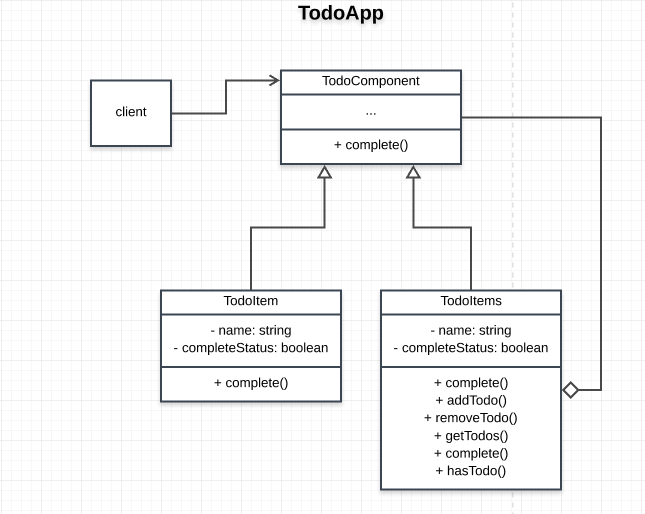

# TodoApp

## How the Composite Pattern is achieved
- The `TodoComponent` defines the interface for the objects in compositon. The `complete` function is shared amongs the Todoitem and the TodoList item.
- Our TodoApp has a system where by all the objects are treated uniformly.
- Our system is represented as a part-whole hierarchies of objects.

## Participants and their Roles
### Participants
- Component: ```TodoComponent``` in [Component.js](./Component.js)
- Leaf: ```TodoItem``` in [Component.js](./Component.js)
- Composite: ```TodoList``` in [Component.js](./Component.js)
- Client: ```TodoApp``` in [App.js](./App.js)

### Roles
Component(TodoComponent)
- implements a behaviour common to all classes

Leaf(TodoItem)
- does not have children
- defines behaviours for primitive objects

Composite(TodoList)
- can have children
- defined behaviours such as `addTodo`, `removeTodo` for the children
- stores the list of todos related to this Todo

Client(TodoApp)
- manipulate object in the composition through the component interface. eg: `addToTodo`, `createTodo`

## UML Class and Sequence Diagrams

