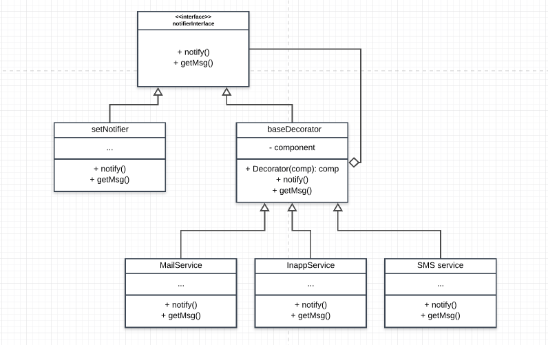

# Notifier

## How this implemanetation acieves the Decorator Pattern
- The `notify` method is flexible and is updated dynamically
- The decorator acts as a wrapper and calls the wrappee(comp) method `notify` when it the decorator is called. This also return a new interface for the next component.

## Participants and their Roles
### Participants
- Component: notifierInterface in [notifierInterface.js](./notifierInterface.js)
- ConcreteComponent: setNotifier in [bases.js](./bases.js)
- Decorator: Decorator in [bases.js](./bases.js)
- ConcreteDecorator: `mailService`, `SMSservice` and `InAppService` in [concreteDecorators.js](concreteDecorators.js)

### Roles
Component(notifierInterface)
- defines the interface where the notify method lives

ConcreteComponent(setNotifier)
- This defines the object that can be decorated.
- it return the interface

Decorator(decorator)
- this maintains a refernce to the concreteComponent(setNotifier)
- defines the method from the component

ConcreteDecorator(mailService, SMSservice and InAppService)
- adds functionalities to the component(setNotifier)

## UML Class and Sequence Diagrams

