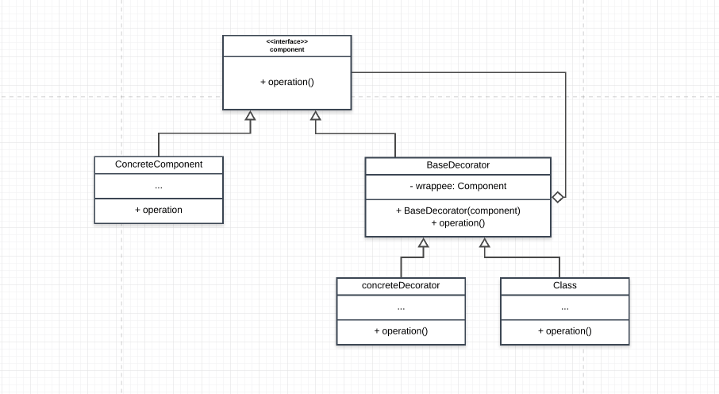

# Decorator Pattern

This is simply adding functionality to another object dynamically. This design pattern allows behavior to be added to an individual object dynamically, without affecting the behavior of other objects from the same class. This pattern adheres to the Single Resposibility Principle. Another name for this is Wrapper. This pattern offers a flexible alternative to subclassing(inheritance) when extending functionalities.

## Main idea
- this intent of this pattern is to add functionality to an object dynamically

## When to use the pattern
- when you want to add functionalities to an object withouct affecting other objects dynamically
- when you notice you are subclassing too much just to extend functionalities

## Participants and their roles
### Participants
- Component
- ConcreteComponent
- Decorator
- ConcreteDecorator

### Rolees
Component
- defines the interface for the objects that can be decorated

ConcereteComponent
- this is the object that can be decorated

Decorator
- maintains a reference to a component that can be decorated
- defines the interface that the component conforms to

ConcreteDecorator
- adds state or functionalities to the component

## Advantages and Disadvantages
### Advantages
- it is flexible
- object functionalies are composable with different decorators
- adding and removing of functionalities dynamically
- 

### Disadvantages
- unidentical interface of the decorator and the object to decorate
- it could be hard to trace bugs if there is an error in one of the functionalites

## UML Class and Sequence Diagrams

## Implementations

## How it relates with other Patterns
Adapter Pattern
- Decorator pattern extends the functionality of an object while the adapter pattern changes the object interface

Proxy Pattern
- Proxy pattern maintains the same interface of its  subject object  while decorator enhances the interface of its subject object

Composite Pattern
- Decorator pattern is the degenerate of the composite pattern with only one component but the decorator adds functionalites

