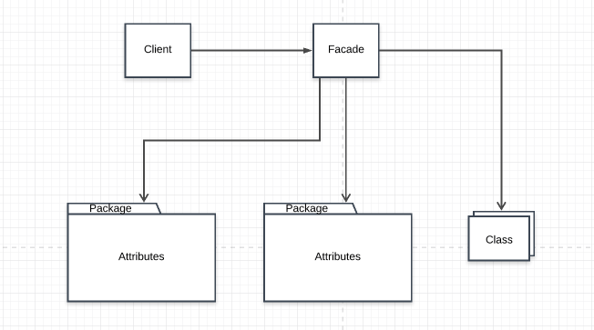

# Facade Pattern

This is used to provide a simplified interface to a complicated system. The aim is to hide the complexity and provide simplicity. A typical example of this is jquery. A lot of complexity is hidden behind the '$' selector but it provides simple to use functionalities.

Imagine you have to work with a bunch of external packages, libraries or framework. The services they provide may be complicated or they may be simple but over time they start getting complicated. Some of the probelems that could start surfacing are having your business logic tightly coupled to those services, loosing track of dependencies, and hard to maintain code.

In JavaScript, a Facade can be implemented as a class ,factory function or any other method that aims at returning an interface that provides simplicity to a bunch of complex methods. Having a Facade allows your business logic to interact easily with external functionality by providing just enough resources that is required.

## Main idea
- provide a simplified interface to the a complex system

## When to use the Facade Pattern
- Making API calls
- Using an external package that adds complexity to your business logic
- Exposing a bunch of complex logic

## Participants and their roles
### Participants
- Facade
- Subsystem classes

### Roles
Facade
- knows which subsystem is responsible for a request
- delegates request to objects in the subsystem

Subsystem Classes
- handle work assigned to it by the facade object
- implement system functionalities

## Advantages and Disadvantages
### Advantages
- isolate cod from the complexity of a subsystem

### Disadvatages
- It can become a god object

## UML Class and Sequence Diagrams

## Implementations
- [VehicleShop](./VehicleShop/README.md)

## How it relates with other Patterns
Adapter Pattern
- Adapter usually works with and wraps an object to change the interface of the object while the facade work with the whole subsystem.

Mediator Pattern
- Facade and Mediator share similar functionalities being that they can try organize collaboration between classes

Singleton Pattern
- A facade can be a singleton since a single instance is sufficient most of the time

