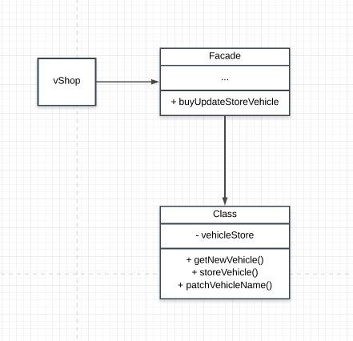

# VehicleShop

## How this implemanetation achieves the Facade Pattern
- The `facade` provides a simple interface from the `vehicleService` class.

## Participants and their Roles
### Participants
- Facade: facade in [Facade.js](./Facade.js)
- Subsystem Classes: VehicleService and Vehicle in [VehicleServices.js](./VehicleServices.js)

### Roles
Facade(facade)
- deligates request to the subsystem

Subsystem classes(VehicleService and Vehicle)
- handles the work assigned to it by the facade
- implements system functionlities

## UML Class and Sequence Diagrams

