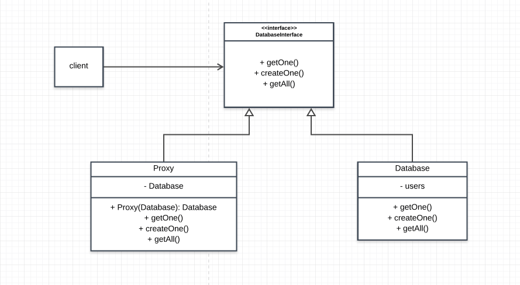

# DBProxy

## How this implemantation acieves the Proxy Pattern
- The `Proxy` in [Proxy.js](./Proxy.js) acts as object that repesents another object ie `Database`

## Participants and their Roles
### Participants
- Proxy: Proxy in [Proxy.js](./Proxy.js)
- Subject: DatabaseInterface in [DatabaseInterface.js](./DatabaseInterface.js);
- RealSubject: Database in [Database.js](./Database.js)

### Roles
Proxy
- maintains a reference to the subject since the subject and the real subject share the same interface
- controls access to the real subject

Subject(DatabaseInterface)
- defines an interface for the proxy so that the proxy can be used anywhere in place of the real subject

RealSubject(Database)
- this is the object the proxy represents

## UML Class and Sequence Diagrams

