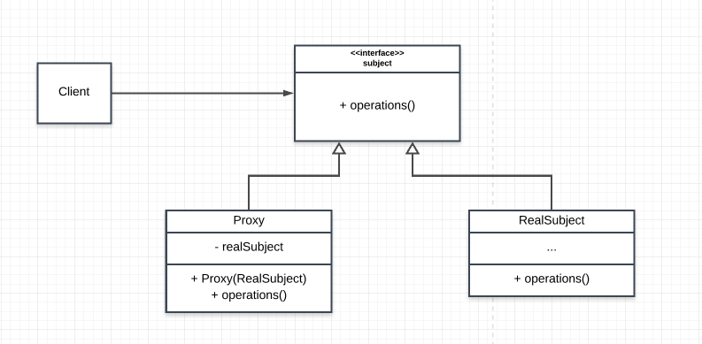

# Proxy Pattern

This is simply an object representing another object. The Proxy Pattern provides a surrogate or placeholder for another object to control access to it.

## Main idea
- The intent of this pattern is to provide a Placeholder for an object to control references to it.

## When to use the pattern
- when you want to control access to an object
- when you want to provide a sophisticated reference to an object

### Cases where the Proxy pattern are applicable
- Virtual Proxies: delaying the creation and initialization of expensive objects until needed, where the objects are created on demand (For example creating the RealSubject object only when the doSomething method is invoked).
- Remote Proxies: providing a local representation for an object that is in a different address space.
- Protection Proxies: where a proxy controls access to RealSubject methods, by giving access to some objects while denying access to others.
- Smart References: providing a sophisticated access to certain objects such as tracking the number of references to an object and denying access if a certain number is reached, as well as loading an object from database into memory on demand.

## Participants and their roles
### Participants
- Proxy
- Subject
- RealSubject

### Rolees
Proxy
- maintains a reference that lets the proxy access the real subject. 
- Proxy may refer to a Subject if the RealSubject and Subject interfaces are the same
- provides an interface that is similar to the subject so that proxy can be substituted for the real subject
- controls access the real object
- responsible for creating or deleting the real subject
Other responsibilities depend on the kind of proxy:
- remote proxies are responsible for encoding a request and its arguments and for sending the encoded request to the real subject in a different address space.
- virtual proxies may cache additional information about the real subject so that they can postpone accessing it.
- protection proxies check that the caller has the access permissions required to perform a request.

Subject
- defines the common interface for RealSubject and Proxy so that a Proxy can be used anywhere a RealSubject is expected.

RealSubject
- defines the real object that the proxy represents.

## Advantages and Disadvantages
### Advantages
- A remote proxy can hide the fact that an object resides in a different address space.
- A virtual proxy can perform optimizations such as creating an object on demand.
- Both protection proxies and smart references allow additional housekeeping tasks when an object is accessed.
- The proxy works even if the service object isn’t ready or is not available.
- You can manage the lifecycle of the service object when clients don’t care about it.

### Disadvantages
- Overcomplication of code due to introduction of new classes
- delayed response time from the real subject

## UML Class and Sequence Diagrams

## Implementations
- [DBProxy](./DBProxy/README.md)
